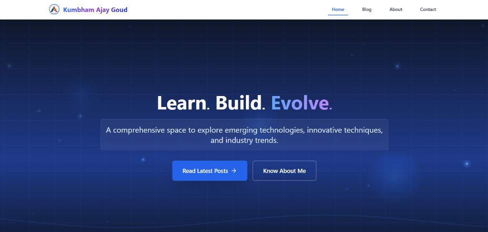
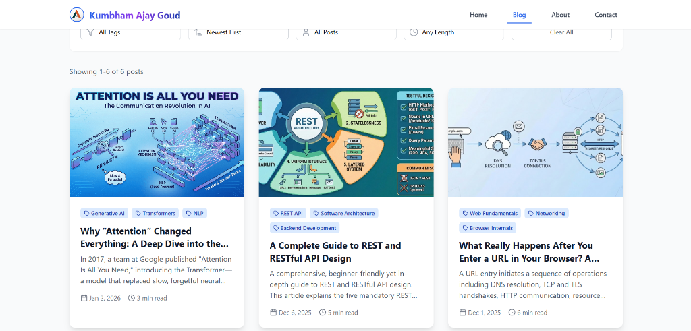

# Developer Blogging Platform

[](https://opensource.org/licenses/MIT)
[](https://www.typescriptlang.org/)
[](https://reactjs.org/)
[](https://supabase.com/)
[](https://tailwindcss.com/)
[](https://vitejs.dev/)

A modern, full-stack blogging platform built with React, TypeScript, and Supabase. Designed for developers to share technical knowledge with a focus on performance, security, and user experience.

**Live Site:** [ajaykumbham-blog.vercel.app](https://ajaykumbham-blog.vercel.app/)

## Screenshots

### Home Page


### Blog Listing


## Table of Contents

- [Features](#features)
- [Technology Stack](#technology-stack)
- [Getting Started](#getting-started)
- [Project Structure](#project-structure)
- [Development](#development)
- [Documentation](#documentation)
- [Contributing](#contributing)
- [License](#license)

## Features

### Public Features

- **Modern Landing Page** - Animated hero section with gradient backgrounds
- **Blog Listing** - Advanced search, tag filtering, read time estimation, and sorting
- **Individual Blog Posts** - Syntax highlighting for code blocks with reading time
- **About Page** - Career highlights, technical skills, and downloadable resume
- **Contact Form** - FormSubmit integration for direct email delivery
- **Newsletter Subscription** - Brevo integration with email validation
- **Unsubscribe Management** - GDPR-compliant newsletter unsubscribe functionality

### Admin Features

- **Secure Admin Panel** - Supabase authentication with protected routes
- **Blog Management** - Full CRUD operations for blog posts
- **Rich Text Editor** - Markdown support with image upload capabilities
- **Email Notifications** - Automated subscriber notifications on post publication
- **Site Settings** - Configure author information, social links, and metadata
- **Career Management** - Add and edit career highlights with metrics
- **Newsletter Management** - View subscriber analytics and send test notifications
- **File Upload** - Resume upload with automatic storage management

### Technical Features

- **Responsive Design** - Mobile-first approach with Tailwind CSS
- **Type Safety** - Full TypeScript implementation throughout the application
- **Real-time Database** - Supabase PostgreSQL with Row Level Security (RLS)
- **Cloud Storage** - Supabase storage for blog covers and resume files
- **Email Automation** - Brevo integration for transactional emails
- **Error Handling** - Comprehensive error boundaries and user feedback
- **Performance Optimized** - Vite build system with code splitting and lazy loading

## Technology Stack

### Frontend
- **React 18** - Modern React with hooks and functional components
- **TypeScript** - Static typing for enhanced code quality
- **Tailwind CSS** - Utility-first CSS framework
- **React Router** - Client-side routing
- **React Hook Form** - Form state management and validation
- **Lucide React** - Icon library

### Backend
- **Supabase** - Backend-as-a-Service platform
  - PostgreSQL database
  - Authentication and authorization
  - Cloud storage
  - Row Level Security (RLS)

### Third-Party Services
- **Brevo (Sendinblue)** - Email marketing and transactional emails
- **FormSubmit** - Contact form handling
- **Vercel** - Deployment and hosting

### Development Tools
- **Vite** - Fast build tool and development server
- **ESLint** - Code linting
- **PostCSS** - CSS processing
- **Yup** - Schema validation
- **date-fns** - Date manipulation

## Getting Started

### Prerequisites

- Node.js (v18 or higher)
- npm or yarn
- Supabase account
- Brevo account (for email features)

### Installation

1. **Clone the repository**
   ```bash
   git clone https://github.com/AjayKumbham/personal-blog-platform.git
   cd personal-blog-platform
   ```

2. **Install dependencies**
   ```bash
   npm install
   ```

3. **Environment configuration**
   
   Copy the example environment file:
   ```bash
   cp .env.example .env
   ```
   
   Configure the following environment variables:
   ```env
   VITE_SUPABASE_URL=your_supabase_project_url
   VITE_SUPABASE_ANON_KEY=your_supabase_anon_key
   VITE_BREVO_API_KEY=your_brevo_api_key
   VITE_BREVO_LIST_ID=your_newsletter_list_id
   VITE_SENDER_EMAIL=your_verified_sender_email
   ```

4. **Database setup**
   
   Refer to [SETUP.md](./SETUP.md) for detailed database configuration instructions.

5. **Start development server**
   ```bash
   npm run dev
   ```

The application will be available at `http://localhost:5173`

## Project Structure

```
src/
├── components/
│   ├── ui/              # Reusable UI components (Button, Card, Toast)
│   ├── layout/          # Header, Footer layout components
│   ├── blog/            # Blog-specific components
│   ├── newsletter/      # Newsletter signup and Brevo integration
│   └── auth/            # Authentication components
├── pages/
│   ├── admin/           # Admin dashboard, login, post management
│   ├── Home.tsx         # Landing page with hero and recent posts
│   ├── Blog.tsx         # Blog listing with search and filters
│   ├── BlogPost.tsx     # Individual blog post display
│   ├── About.tsx        # About page with career information
│   ├── Contact.tsx      # Contact form page
│   └── Unsubscribe.tsx  # Newsletter unsubscribe page
├── services/            # API integrations (blog, newsletter, email, settings)
├── hooks/               # Custom React hooks (useAuth, useToast)
├── types/               # TypeScript type definitions
└── lib/                 # Supabase client configuration
```

## Development

### Available Scripts

```bash
npm run dev          # Start development server
npm run build        # Build for production
npm run preview      # Preview production build
npm run type-check   # TypeScript type checking
npm run lint         # ESLint code linting
```

### Code Quality

- **TypeScript** - Strict mode enabled for maximum type safety
- **ESLint** - Configured with React and TypeScript rules
- **Prettier** - Code formatting (via ESLint integration)

## Documentation

- **[Setup Guide](./SETUP.md)** - Complete installation and configuration
- **[Admin Access Guide](./ADMIN_ACCESS.md)** - Admin panel access instructions
- **[Contributing](./CONTRIBUTING.md)** - Development workflow and guidelines
- **[Code of Conduct](./CODE_OF_CONDUCT.md)** - Community standards
- **[License](./LICENSE.md)** - MIT License terms

## Contributing

Contributions are welcome! Please read [CONTRIBUTING.md](./CONTRIBUTING.md) for details on our code of conduct and the process for submitting pull requests.

### Quick Contribution Guide

1. Fork the repository
2. Create a feature branch (`git checkout -b feature/amazing-feature`)
3. Commit your changes (`git commit -m 'Add amazing feature'`)
4. Push to the branch (`git push origin feature/amazing-feature`)
5. Open a Pull Request

## License

This project is licensed under the MIT License - see the [LICENSE.md](./LICENSE.md) file for details.

## Contact

**Ajay Goud Kumbham**
- Email: ajaygoud.kumbham@gmail.com
- GitHub: [@AjayKumbham](https://github.com/AjayKumbham)
- Live Site: [ajaykumbham-blog.vercel.app](https://ajaykumbham-blog.vercel.app/)

## Acknowledgments

- Built with [React](https://reactjs.org/)
- Backend powered by [Supabase](https://supabase.com/)
- Email services by [Brevo](https://www.brevo.com/)
- Deployed on [Vercel](https://vercel.com/)
